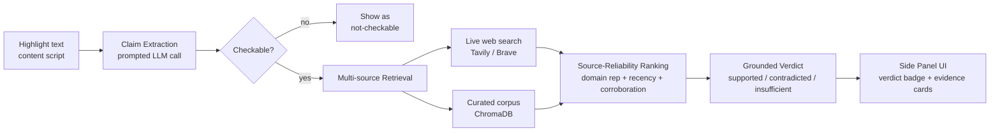

# Pravda — A Browser Extension That Catches Lies

> Highlight any claim on a webpage. Get a sourced verdict in seconds — without leaving the page.

**30-second demo:** _[Loom link placeholder — record: highlight a claim → click "Check with Pravda" → side panel shows verdict + evidence cards]_

---

## What it does

Pravda lets you highlight any claim on a webpage and instantly scores it for evidence quality. It extracts the atomic claim, retrieves evidence from live web search and a curated vector corpus, ranks the sources by transparent reliability signals, and returns a grounded verdict — **supported**, **contradicted**, or **insufficient evidence** — with citations, all in a Chrome side panel.

## Architecture



**Request flow:** `extension content script → background service worker → FastAPI /check → extract → retrieve → rank → verdict → side panel render`

## Tech stack

| Component | Tool | Why |
|---|---|---|
| Extension | Chrome Manifest V3, TypeScript, esbuild | Current standard; content script + side panel + background worker |
| Claim extraction & verdicts | Provider interface — OpenAI GPT-4o (default) or Anthropic Claude Sonnet | Prompted extraction; no custom model needed for v1 |
| Web search | Provider interface — Tavily (default) or Brave Search | Live evidence retrieval, degrades gracefully without a key |
| Curated corpus | ChromaDB (persistent, local) | Vector store for trusted reference sources |
| Embeddings | OpenAI `text-embedding-3-small` | Cost-effective, high quality |
| Source ranking | Custom heuristic (domain reputation + recency decay + corroboration) | Transparent, explainable — not a black-box score |
| Backend | FastAPI (async) | Orchestrates extraction → retrieval → ranking → verdict |
| Container | Docker + docker-compose | Reproducible deployment |

## Quickstart

### Backend

```bash
cd backend
python -m venv .venv
.venv/Scripts/activate        # Windows; use .venv/bin/activate on macOS/Linux
pip install -r requirements.txt
cp ../.env.example ../.env    # fill in OPENAI_API_KEY at minimum
uvicorn app.main:app --reload --port 8000
```

Required env var: `OPENAI_API_KEY` (or `ANTHROPIC_API_KEY` + `LLM_PROVIDER=anthropic`).
Optional: `TAVILY_API_KEY` or `BRAVE_API_KEY` — without one, Pravda still works using corpus-only retrieval (`SEARCH_PROVIDER=none` is also valid).

Seed the curated corpus once:

```bash
python -m eval.seed_corpus     # run from repo root, not backend/
```

### Extension

```bash
cd extension
bun install   # or: npm install
bun run build # or: npm run build  -> outputs extension/dist/
```

Then in Chrome: `chrome://extensions` → enable **Developer mode** → **Load unpacked** → select the `extension/` folder.

Highlight any sentence on a webpage, click the **"Check with Pravda"** button that appears, and the side panel opens with the verdict.

### Docker

```bash
docker compose up --build
```

### Tests & eval

```bash
make test    # pytest, offline, mocked LLM/search
make eval    # runs the labeled claim set against the real pipeline (needs API keys)
```

## Eval results

Seeded with 14 labeled claims (`eval/labeled_claims.json`) — a mix of true, false, and inherently unverifiable claims. **I'll expand this to 30-50 claims; the harness (`eval/run_eval.py`) is built to scale to that without changes.**

| Metric | Result |
|---|---|
| Verdict accuracy (true/false claims) | _run `make eval` with an API key to populate_ |
| Correct abstention rate (unverifiable claims) | _run `make eval` with an API key to populate_ |
| Latency p50 / p95 | _run `make eval` with an API key to populate_ |

## Design decisions

1. **Claim extraction as a discrete step.** A highlighted passage often contains several claims, or none that are checkable ("this is beautiful" isn't verifiable). `backend/app/extract/extractor.py` makes a single prompted LLM call that splits the passage into atomic claims and tags each as checkable/not, with a reason. No fine-tuned classifier — that's explicitly future work (see below).

2. **Multi-source retrieval.** `backend/app/retrieve/retriever.py` blends live web search (Tavily/Brave, for current events and breadth) with a curated ChromaDB corpus (for stable, high-reliability ground truth). Every `EvidenceChunk` carries `provenance` (`web` | `corpus`) so the UI and verdict step both know where evidence came from.

3. **Source-reliability ranking.** `backend/app/rank/reliability.py` scores every chunk as a weighted blend of three inspectable signals — `domain_reputation` (tiered lookup table: .gov/.edu/major wire services > mainstream outlets > general web > known-low-quality), `recency` (exponential decay), and `corroboration` (how many independent domains in the retrieved set back the same evidence). The final score and each signal are returned to the client — nothing is hidden in a black box.

4. **Grounded verdicts, not confident guesses.** `backend/app/verdict/generator.py` only lets the LLM choose from evidence it's been given, and a hard rule (not just prompt instruction) forces `insufficient` when there's no evidence or only low-reliability evidence (`reliability_score < 0.3`) — the LLM is never even called in that case. This is the abstain path that separates a fact-checker from a hallucination machine.

5. **A real evaluation.** `eval/run_eval.py` runs the full pipeline against a hand-labeled claim set and reports verdict accuracy on decidable claims, correct-abstention rate on unverifiable ones, and p50/p95 latency — see table above.

## Responsible use

**Pravda surfaces evidence to help you judge claims — it is not an oracle of truth.** It shows you what credible sources say and how reliable those sources are; it does not (and should not) make the final call for you. Verdicts can be wrong, sources can be biased or out of date, and "insufficient evidence" often means exactly that — not "false." Always check the linked sources yourself for anything that matters.

## Limitations & future work

- **Claim extraction is prompted, not a fine-tuned classifier.** Works well for clearly-stated factual claims; may miss claims that require significant world-model inference, or over-split nuanced compound statements. A small fine-tuned extraction model is the natural next step if this needs to scale.
- **Reliability scoring is heuristic, not learned.** The domain-reputation table (`HIGH_TRUST_DOMAINS` / `MEDIUM_TRUST_DOMAINS` in `rank/reliability.py`) is a small, manually curated list — most real-world domains fall into the neutral default (0.5) bucket. A learned reputation model trained on fact-checker agreement data would generalize better.
- **The curated corpus is intentionally small** (9 seed documents) — it's meant to demonstrate the multi-source pattern, not to be exhaustive. Live web search carries most of the retrieval load for v1.
- **No stance-detection model** — the verdict LLM call infers support/contradict implicitly from evidence text rather than each chunk being explicitly labeled by a separate stance classifier (the `stance` field on `EvidenceChunk` exists but is currently unused — wiring it up is a natural follow-on).
- **Single highlight at a time** — no batch-checking of a full page, and no history/persistence of past checks across sessions.
- **Not published to the Chrome Web Store** — load-unpacked only for now.

## Project structure

```
pravda/
  extension/                # Chrome MV3 (TypeScript, esbuild)
    manifest.json
    content-script.ts       # capture highlighted text, show "Check with Pravda" button
    background.ts           # message passing extension <-> backend, opens side panel
    sidepanel/               # results UI: verdict badge, evidence cards, abstain state
    types.ts                 # shared TS types mirroring backend schema.py
  backend/
    app/
      api/routes.py          # POST /check, GET /health
      extract/extractor.py   # prompted claim extraction
      retrieve/               # web search (Tavily/Brave) + ChromaDB curated corpus
      rank/reliability.py     # transparent source-reliability scoring
      verdict/generator.py    # grounded verdict + citations
      llm/                    # OpenAI / Anthropic provider interface
      schema.py                # Claim, EvidenceChunk, Verdict, CheckRequest/Response
      pipeline.py               # orchestrates the full flow
    tests/                     # pytest, offline, mocked LLM/search
  eval/
    labeled_claims.json        # seed labeled claim set
    seed_corpus.py              # seeds ChromaDB with trusted reference docs
    run_eval.py                  # accuracy / abstention / latency harness
  Dockerfile
  docker-compose.yml
  Makefile
  .env.example
```

## Punch list: MVP → finished portfolio piece

- [ ] Expand `eval/labeled_claims.json` to 30-50 claims and run `make eval` to populate the results table above with real numbers
- [ ] Record the 30-second Loom demo and drop the link at the top of this README
- [ ] Wire up the unused `stance` field on `EvidenceChunk` via an explicit per-chunk stance-classification step (currently inferred implicitly by the verdict LLM)
- [ ] Grow `HIGH_TRUST_DOMAINS` / `MEDIUM_TRUST_DOMAINS` based on which domains actually show up during real usage
- [ ] Add a small UI affordance for "report a wrong verdict" to start collecting disagreement data for future fine-tuning
- [ ] Consider a lightweight cache (claim text → verdict, TTL'd) to cut latency and cost on repeat highlights of the same claim
- [ ] Package and publish to the Chrome Web Store
